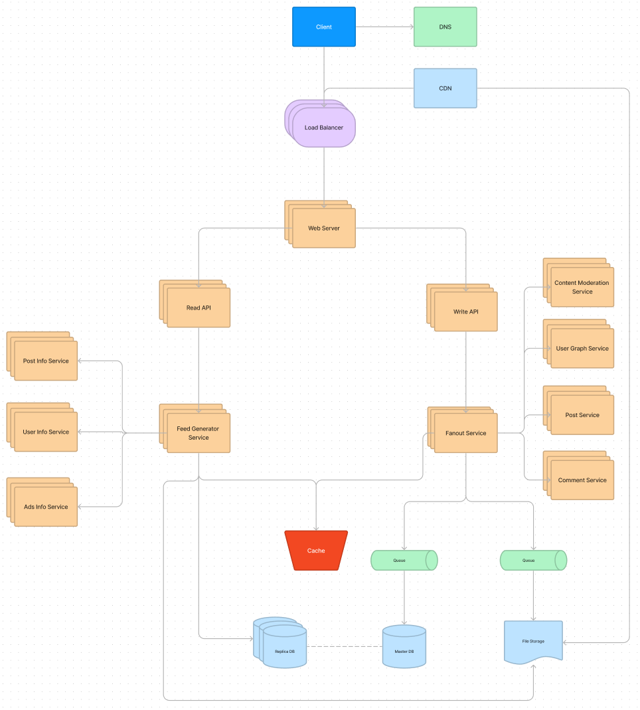

# Goal:
Design Instagram posts feed

# Requirements:
1. The user news feed must be generated in near real-time based on the feed activity from the people that a user follows
2. The feed items contain text and media files (images, videos)

# Use cases:
1. User create post
2. User views user posts (activity from the user)
3. User views posts feed (activity from people the user is following)
4. User like post
5. User comment post

# Constraints and assumptions

### General

1. Traffic is not evenly distributed
2. Creating and publish post must be fast
3. 500 million daily active users / 2.5 billion users per month
4. 95 million posts per day / 2.9 billion posts per month
  - Each post averages a fanout of 10% of deliveries
  - 9.5 billion delivered on fanout per day / 294.5 billinon per month
  - 10 billion read requests per day / 30 billion per month

### Posts Feed

1. Viewing the feed should be fast
2. Instagram is more read heavy than write heavy. Optimize for fast reads of posts and media files

### Calculations

Size per post: ~200KB
# High level design

# Design core components

### Use case: User create and publish post

We could store the user's own posts in a relational database. After, we should query created post to feed for followers. Fanning out posts to all followers overload a traditional relational database.  We can use Memory Cache (Reading 1 MB sequentially from memory takes about 250 microseconds).

To store media files - we should use File Object Store

1. Client send request to Web Server  through Load Balancer.
2. Request is forwarded from the Web Server to Write  API
3. Request is forwarded from the Write API to Post Service
4. Post Service save post data in Master DB (relational) through Queue
5. Post Service Query User Graph Service for user's followers
6. Post Service add needed post data to Memory Cache
7. Post Service send media files to File Storage through Queue.

### Use case: User views user posts
1. Client send request to Web Server  through Load Balancer.
2. Request is forwarded from the Web Server to Read  API
3. Request is forwarded from the Read API to Feed Generator Service
4. Gets the feed data stored in the Memory Cache (post ids and user ids) - O(1)
5. Queries the Post Info Service to get additional info about the post ids - O(n) (from relational database )
6. Queries the User Info Service to get additional info about the user ids - O(n) (from relational database )
7. Get media files from CDN

### Use case: User views posts feed
1. Client send request to Web Server through Load Balancer.
2. Request is forwarded from the Web Server to Read  API
3. Request is forwarded from the Read API to Feed Generator Service
4. Gets the feed data stored in the Memory Cache (post ids and user ids) - O(1)
5. Queries the Post Info Service to get additional info about the post ids - O(n) (from relational database )
6. Queries the User Info Service to get additional info about the user ids - O(n) (from relational database )
7. Get media files from CDN

### Use Case: User like post
1. Client send request to Web Server  through Load Balancer.
2. Request is forwarded from the Web Server to Write  API
3. Request is forwarded from the Write API to Post Service
4. Post Service store like data in relational database

### Use Case: User comment post
1. Client send request to Web Server  through Load Balancer.
2. Request is forwarded from the Web Server to Write  API
3. Request is forwarded from the Write API to Comment Service
4. Comment Service store like data in relational database

# Scale the design
The Fanout Service is a potential bottleneck. Users with millions of followers could take several minutes to have their posts go through the fanout process.

Central Services like Read / Write API / Read DB can be potential SPOF.

Additional optimizations include:
1. Load balancer should be included with each service (hide it on scheme to prevent mess)
2. Keep only several hundred posts for each user feed in the Memory Cache and for active users
3. Store only a month of posts in the Post Info Service and store only active users in the User Info Service

We should also consider moving some data to a NoSQL Database.
